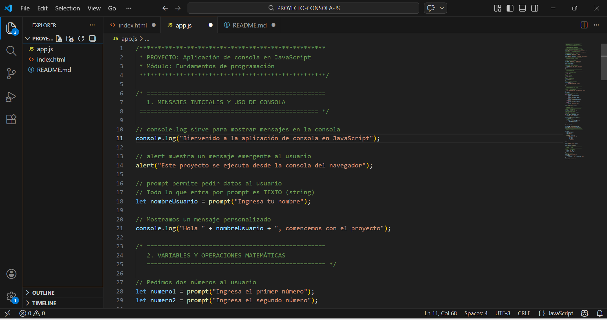
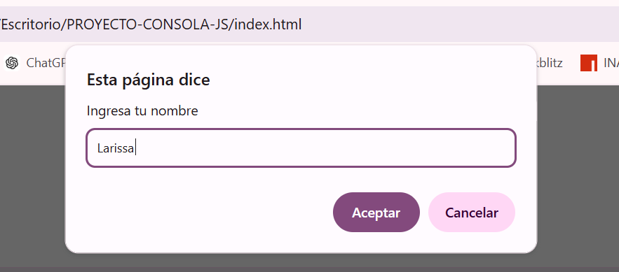
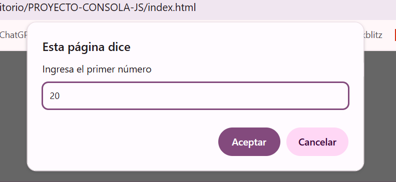
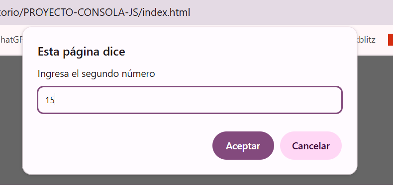
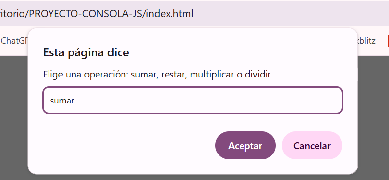
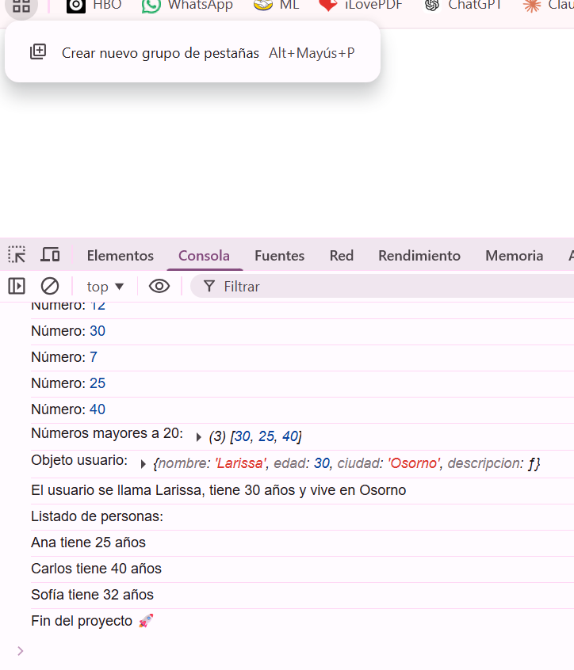

# Proyecto Aplicación de Consola en JavaScript

Este proyecto fue desarrollado como parte del módulo **Fundamentos de Programación en JavaScript**.

## Funcionalidades
- Uso de consola, alert y prompt
- Operaciones matemáticas básicas
- Uso de condicionales y ciclos
- Implementación de funciones
- Manejo de arreglos y objetos

## Ejecución
1. Abrir `index.html` en el navegador
2. Abrir la consola (F12)
3. Seguir las instrucciones

## Objetivo
Demostrar el uso de los conceptos fundamentales de JavaScript en una aplicación simple de consola.

---

## Evidencias de funcionamiento

### 1 Estructura del proyecto en VS Code

### 2 Inicio de ejecución

### 3 Operación matemática 1

### 4 Operación matemática 2

### 5 Operación matemática 3

### 6 Resultado Arreglo Objeto

